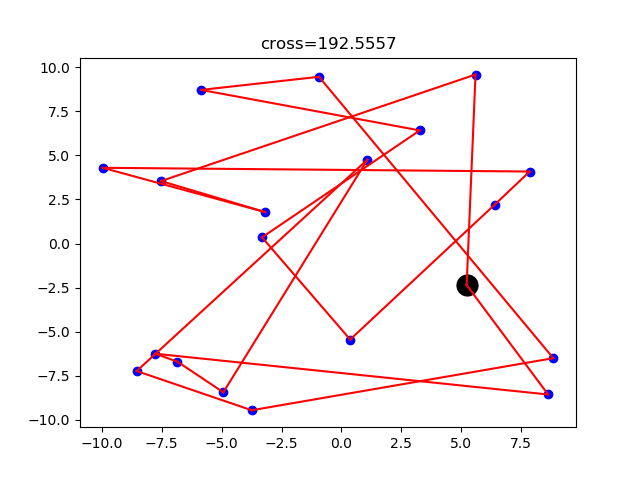

* 所用的数据：
	* 表示是的10个点之间的距离矩阵
```c
10
0 58 82 89 17 50 26 48 70 19
58 0 74 46 70 2 70 49 87 60
82 74 0 58 76 98 37 97 34 67
89 46 58 0 15 17 28 69 46 79
17 70 76 15 0 98 60 69 97 89
50 2 98 17 98 0 81 14 43 47
26 70 37 28 60 81 0 43 73 56
48 49 97 69 69 14 43 0 39 0
70 87 34 46 97 43 73 39 0 53
19 60 67 79 89 47 56 0 53 0
```

### 随机生成数据并展示动图

* 黑色的点是起点。
* 我在知乎上看到类似的图，就试着改了下自己的代码也实现了这个效果。生成gif是基于我之前写的代码

