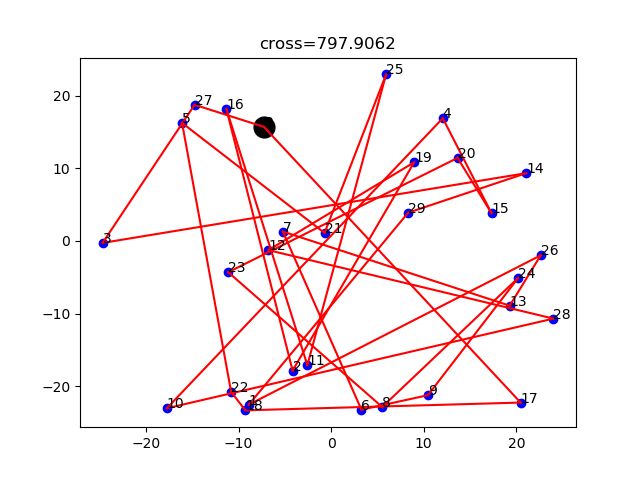

# 关于TSP

TSP，是货郎担问题，也就是中国邮递员问题（少数世界级问问题，用中国人命名的问题hhh）。就是n个点直接连通需要不同的代价，如果想要找到不重复的经历完所有点，然后在回到初始点的用的代价最小，以及对应的路径。

**下面的GIF由TSP.py生成**



# 一段测试数据
```c
10
0 58 82 89 17 50 26 48 70 19 
58 0 74 46 70 2 70 49 87 60 
82 74 0 58 76 98 37 97 34 67 
89 46 58 0 15 17 28 69 46 79 
17 70 76 15 0 98 60 69 97 89 
50 2 98 17 98 0 81 14 43 47 
26 70 37 28 60 81 0 43 73 56 
48 49 97 69 69 14 43 0 39 0 
70 87 34 46 97 43 73 39 0 53 
19 60 67 79 89 47 56 0 53 0 
```

输出：

```c
Value:244
0 -> 4 -> 3 -> 6 -> 2 -> 8 -> 5 -> 1 -> 7 -> 9 -> 0
```

# C++代码详细解释

## 定义了两个宏，主要是为了加速运算

* 第一个是**RAND(b,e)** 生成在$[b,e)$这个区间上的整数
* 第二个是**RANDFLOAT()** 是为了生成(0,1)之间的数。


## 定义全局变量

```c
double **Mat;
int *Path, *tempPath;
double Value, tempValue;
int N = 0;
```
* Mat是来存储距离矩阵的
* Path存储路径
* Value存储路劲所对应的函数。这里考虑的是具体的数值
* N表示有多少个点
* 所有前面加了temp都表示临时变量。


## 函数解释

* `double CalValue(int *p)` 函数用于给输入的路劲下，求对应的value值。
* `void refresh()` 将temp的数组和具体数值恢复。为了下一次的考虑
* `void change()` 覆盖掉原来的路劲。进行存储。
* `void initialPath()` 初始化路径。并算出初始值。
